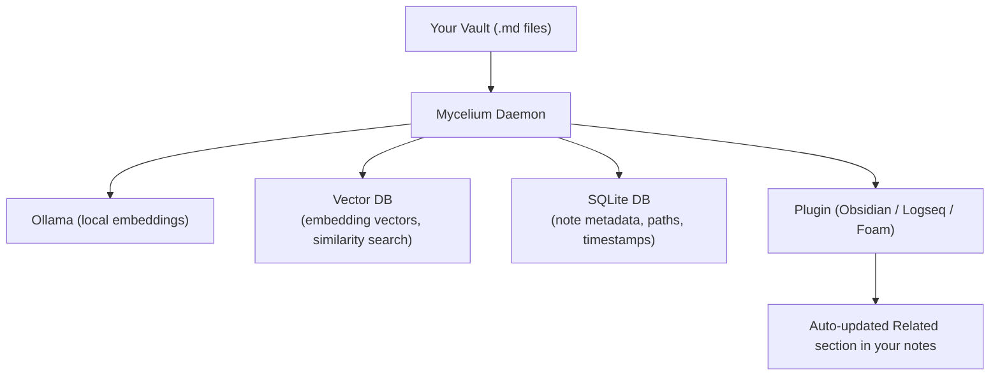
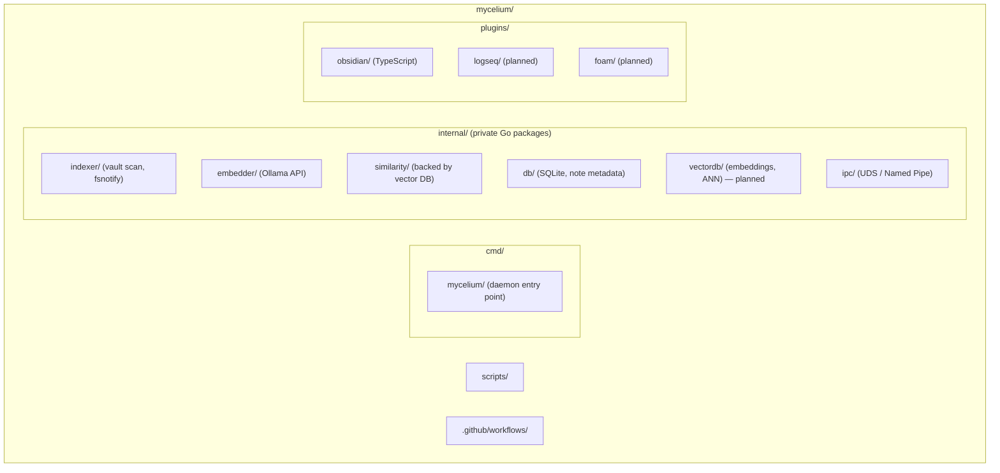
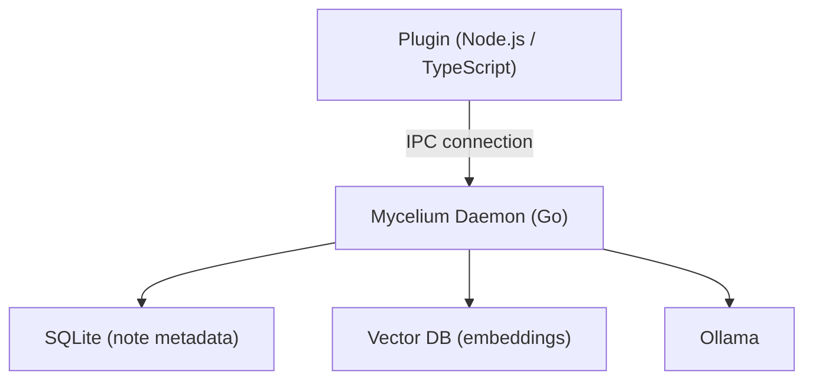

# 🍄 Mycelium

[](https://codecov.io/gh/GyeongHoKim/mycelium)

> Automatically discover and link related notes across your knowledge base — powered by multilingual embeddings, running entirely on your device.

Mycelium is an open-source daemon that watches your local markdown vault, finds semantically related notes, and writes those connections back into your files automatically. Just like the underground fungal network that silently connects trees in a forest, Mycelium works quietly in the background to surface the hidden structure of your knowledge.

---

## How It Works



1. The **daemon** watches your vault folder for changes.
2. When a note is created or updated, the daemon generates an embedding (Ollama), stores it in the **embedded vector DB (chromem-go)**, and keeps note metadata (including content hashes) in SQLite.
3. Similarity is computed via the vector DB. The daemon exposes "related notes" over IPC.
4. The **plugin** (running inside your editor) requests related notes from the daemon and writes them into the file using the editor's internal API. This ensures **"Plugin-as-Writer"** safety, avoiding file system conflicts and preserving undo history.

Everything runs on your device. No cloud. No API keys.

---

## Features

- **Multilingual** — Supports Korean, English, Japanese, Chinese, and 100+ languages out of the box via `multilingual-e5-small`
- **Local-first** — Embeddings (via `chromem-go`) and note metadata (SQLite) stay on your machine
- **Intelligent Updates** — Uses a combination of **Debouncing** (waits for typing to stop) and **Content Hashing** (ignores changes within the `## Related` section) to minimize Ollama API calls and prevent update loops.
- **Plugin-as-Writer** — The daemon never modifies your files directly. The plugin handles all writes via editor APIs, ensuring safety and compatibility with editor features like Undo.
- **Non-destructive** — Only the content between `<!-- mycelium:start -->` and `<!-- mycelium:end -->` is updated; the rest of the note is left untouched.
- **Plugin architecture** — Core logic is editor-agnostic; thin plugins handle each tool's format

---

## Supported Editors

| Editor        | Status       | Related Notes Format                  |
| ------------- | ------------ | ------------------------------------- |
| Obsidian      | ✅ Available | `## Related` section (bottom of note) |
| Logseq        | 🚧 Planned   | `related::` frontmatter property      |
| Foam (VSCode) | 🚧 Planned   | `## Related` section (bottom of note) |

---

## Requirements

- [Ollama](https://ollama.com) — for local embedding generation
- Ollama model: `multilingual-e5-small` (~270MB)

```bash
ollama pull multilingual-e5-small
```

---

## Installation

**Obsidian**

1. Open Settings → Community Plugins → Browse
2. Search for `Mycelium`
3. Install and enable
4. The plugin will automatically download and start the Mycelium daemon on first run (typically installs the daemon under `~/.mycelium/` or the plugin directory and uses config from `~/.mycelium/config.toml`).

Or install manually by copying `plugins/obsidian` into your vault's `.obsidian/plugins/` folder.

**Manual daemon installation (advanced)**

If you prefer to manage the daemon yourself:

```bash
# macOS / Linux
brew install mycelium        # coming soon

# or build from source (replace with the actual repo URL when published):
git clone https://github.com/<org>/mycelium
cd mycelium
go build -o mycelium ./cmd/mycelium
```

---

## Output Format

The **plugin** adds a managed section at the bottom of each note (or in frontmatter for editors like Logseq). It only replaces content between the markers — everything else in your note is untouched.

```markdown
# My Note on HLS Streaming

...your content here...

<!-- mycelium:start -->

## Related

- [[go-astiav segment lifecycle]] · 0.94
- [[HLS.js buffer timeout]] · 0.91
- [[WebCodecs VideoFrame memory]] · 0.87
<!-- mycelium:end -->
```

The `<!-- mycelium:start -->` / `<!-- mycelium:end -->` markers tell the plugin exactly which lines to replace on the next update. You can freely add your own links above or below this section.

---

## Configuration

Configuration lives in `~/.mycelium/config.toml` (one vault path per config; one daemon instance typically serves that vault, and multiple plugins can connect to the same daemon):

```toml
[vault]
path = "/Users/you/Documents/vault"

[embedding]
model   = "multilingual-e5-small"
ollama  = "http://localhost:11434"

[similarity]
top_k     = 5        # how many related notes to show per file
threshold = 0.75     # minimum similarity score (0.0 ~ 1.0)

[output]
format = "section"   # "section" | "frontmatter" (default per editor: Obsidian → section, Logseq → frontmatter)
```

---

## Architecture

The repo layout below is the target design. The `vectordb/` package (vector store for embeddings and ANN search) is planned; until then, similarity may be implemented with an in-memory or external vector store.



### IPC

The daemon and plugin communicate over a Unix Domain Socket (macOS/Linux) or Named Pipe (Windows) — no network stack, no port conflicts.



### Scorer interface

The similarity engine is abstracted behind a `Scorer` interface, making it straightforward to swap or combine algorithms:

```go
type Scorer interface {
    Index(notes []Note) error
    Similar(note Note, topK int) ([]ScoredNote, error)
}
```

Current implementation uses multilingual embeddings + cosine similarity. A BM25-based scorer (for offline / English-only use cases) is planned as an alternative.

---

## Privacy

- All processing happens locally on your machine
- Notes are never sent to any external server
- Note metadata is stored in SQLite at `~/.mycelium/index.db`; embedding vectors are stored in a local vector DB (e.g. under `~/.mycelium/`)
- Ollama runs entirely offline after the initial model download

---

## Roadmap

- [x] Core daemon (Go)
- [ ] SQLite schema with content hashing
- [ ] `chromem-go` integration (Vector DB)
- [ ] Intelligent update logic (Debounce + Hashing)
- [ ] IPC protocol for "Plugin-as-Writer" (fetch-only mode)
- [ ] Obsidian plugin (v2 with IPC fetch)
- [ ] Logseq plugin
- [ ] Foam plugin
- [ ] BM25 scorer (offline fallback, no Ollama required)
- [ ] Hybrid scoring (BM25 + embedding)
- [ ] CLI mode (`mycelium similar <note-path>`)
- [ ] Tag-based similarity boost

---

## Contributing

Contributions are welcome. The daemon is editor-agnostic — if you want to build a plugin for another editor, the IPC protocol is straightforward to implement in any language.

See [CONTRIBUTING.md](./CONTRIBUTING.md) for development setup.

---

## License

MIT License — see [LICENSE](./LICENSE)

---

## Name

Mycelium is the underground fungal network that silently connects trees in a forest, passing nutrients and signals between them. Notes in a knowledge base are like trees — individually complete, but richer when connected. The author's family farms mushrooms in Gangwon Province, Korea.
